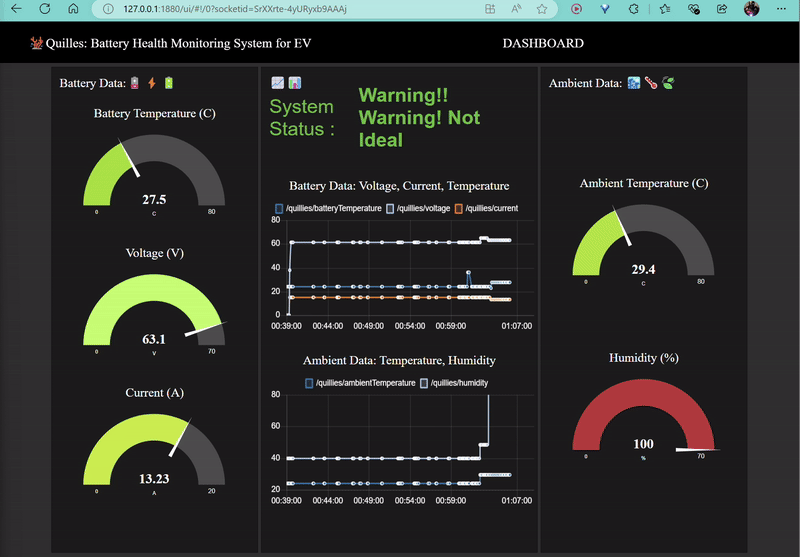
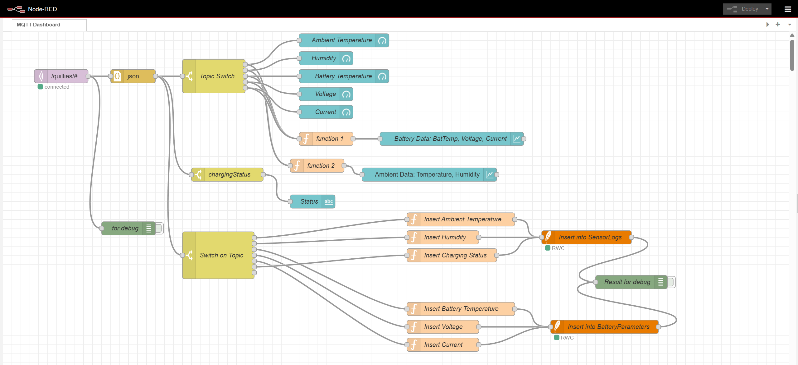
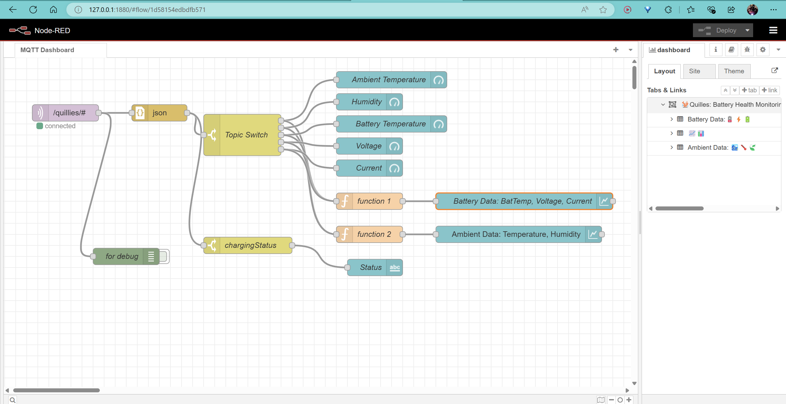
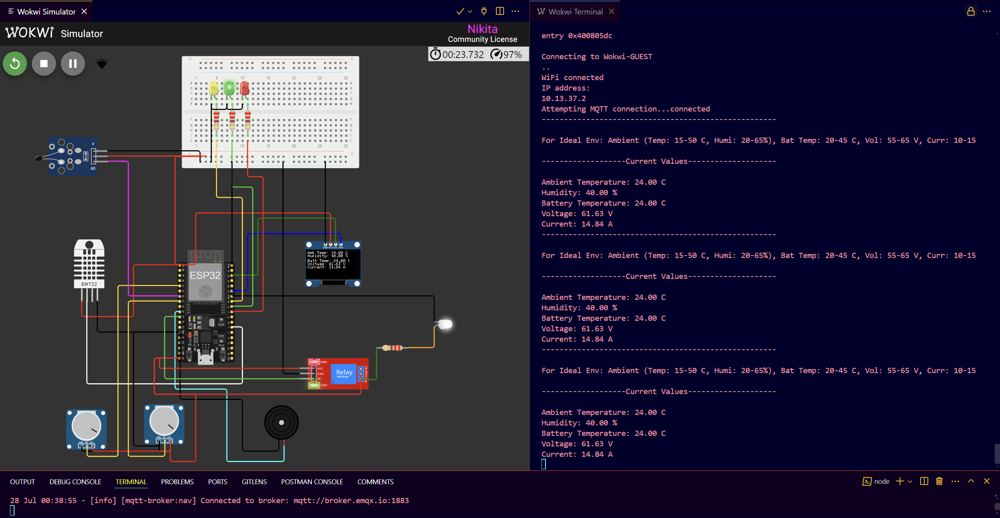
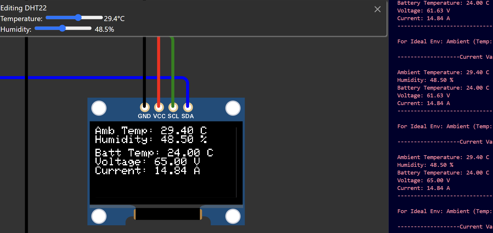

# ⚡IoT-Based Battery Health Monitoring System for EV Charging Using ESP32⚡🔋🚗🛺

## ⚡IoT-Based Battery Health Monitoring System for EV Charging.

Quilles is an IoT-based system designed to monitor battery health for electric vehicle (EV) charging stations. The project leverages an ESP32 microcontroller to gather environmental and battery data, which is then visualized using Node-RED. MQTT is used for real-time data transmission.

## ⚡Features

- Monitors ambient temperature, humidity, battery temperature, voltage, and current.
- Provides visual and audible alerts for non-ideal charging environments.
- Displays real-time data on an OLED screen.
- Integrates with Node-RED for dashboard visualization and data handling.

---

### Screenshots

Below are some screenshots of the Quilles project in action:

1. **Node-RED Dashboard**:

   - ### This is how real-time data visualization of the battery health and charging status on the Node-RED dashboard.
     

2. **Node-RED Dashboard with SQLite**:

   - ### This is how the Node-RED dashboard looks when integrated with SQLite for data storage and retrieval.
     

3. **Node-RED Flow:**

- ### flow 🎴
  

4. **Wokwi Simulation**:

   - ### This is how Wokwi simulation of the ESP32 circuit and code execution looks.
     

5. **OLED Display**:

   - ### This is how information displayed on the OLED screen of the ESP32, including ambient temperature, humidity, battery temperature, voltage, and current.
     

---

## ⚡Components

- **ESP32**: Microcontroller used for data collection and MQTT communication.
- **DHT22**: Sensor for measuring ambient temperature and humidity.
- **NTC Thermistor**: Measures battery temperature.
- **Analog Sensors**: Measure battery voltage and current.
- **OLED Display**: Shows real-time data and alerts.
- **Relay, Buzzer, and LEDs**: Provide alerts and control indicators.

## ⚡🔋Setup Instructions

### Hardware Requirements

1. **ESP32 Microcontroller**
2. **DHT22 Sensor**
3. **NTC Thermistor**
4. **Analog Voltage and Current Sensors**
5. **OLED Display (SSD1306)**
6. **Relay Module**
7. **Buzzer**
8. **LEDs (Green, Yellow, Red)**

### Software Requirements

- **PlatformIO & Wokwi**: For managing and simulating ESP32 code within vscode.
- **Node-RED**: For creating the dashboard and handling MQTT data.
- **MQTT Broker**: Use [broker.emqx.io](http://broker.emqx.io) on port 1883.
- **Arduino IDE**: For writing and uploading code to the ESP32 if not using PlatformIO. (optional).

### Running the Project Locally

1. **Clone the Repository**

   ```bash
   git clone https://github.com/nav9v/quilles-pulse.git
   cd quilles-pulse
   ```

### 6. PlatformIO Setup

1. **Install PlatformIO**:

   - Install PlatformIO as an extension in Visual Studio Code (VSCode) from the [VSCode Marketplace](https://marketplace.visualstudio.com/items?itemName=platformio.platformio-ide).

2. **Open the Project**:

   - Open VSCode.
   - Go to `File` > `Open Folder` and select the `quilles-pulse` folder.

3. **Configure PlatformIO**:

   - PlatformIO will automatically detect the `platformio.ini` file in your project folder and configure the project.

4. **Simulate with Wokwi Extension**:

   - Install the Wokwi Simulator extension from the [VSCode Marketplace](https://marketplace.visualstudio.com/items?itemName=wokwi.wokwi-simulator).
   - Open the `diagram.json` file in VSCode. It should display the circuit if the extension is installed properly.
   - Use the Wokwi Simulator to test and simulate your ESP32 code directly within VSCode.

5. **Build the Project**:

   - After setting up the simulation, click on the **Build Project** button to compile the code.
   - Click on the **Play** button to start the simulation.

6. **Firmware code**:

   - It is in `src\main.cpp`

### 3. Set Up Node-RED

1. **Install Node-RED**:
   - Follow the installation instructions [here](https://nodered.org/docs/getting-started/).

2. **Import Flow**:

   - Open Node-RED in your web browser.
   - Click on the menu (top right) and select `Import` > `Clipboard`.
   - Paste the contents of `flow.json` and click `Import`.

3. **Configure MQTT Nodes**:

   - Double-click on the MQTT nodes in the flow.
   - Set the broker address to `broker.emqx.io` and port to `1883`.
   - Ensure the topics in the MQTT nodes match those used in the ESP32 code.

4. **Customize Dashboard**:
   - Use Node-RED’s dashboard nodes to visualize the data.

### 4. Connect to MQTT Broker

- Ensure that Node-RED is connected to the MQTT broker.
- U can use any broker i have used (broker.emqx.io)

### 5. Verify Operation

1. **Check ESP32 Display**:
   - Observe the OLED display for real-time data and alerts.
2. **Monitor Node-RED Dashboard**:
   - Verify that the dashboard reflects the data from the ESP32 and updates in real time.

## ⚡Troubleshooting

- **ESP32 Not Connecting to WiFi**:
  - Verify SSID and password.
  - Ensure the ESP32 is within range of your WiFi network.
- **Data Not Appearing in Node-RED**:
  - Check MQTT connection settings.
  - Ensure the topics in Node-RED match those used in the ESP32 code.
- **Dashboard Not Updating**:
  - Verify that the Node-RED flow is properly configured and connected.
